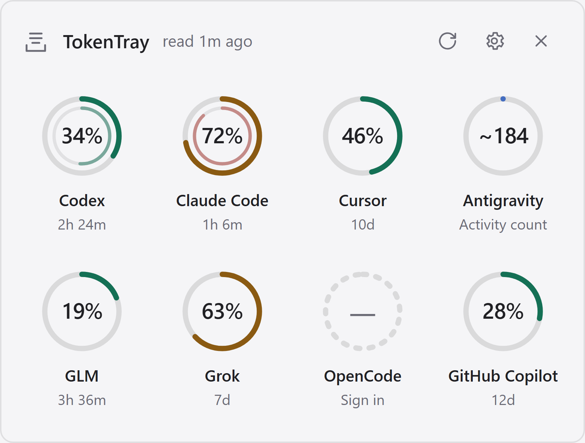
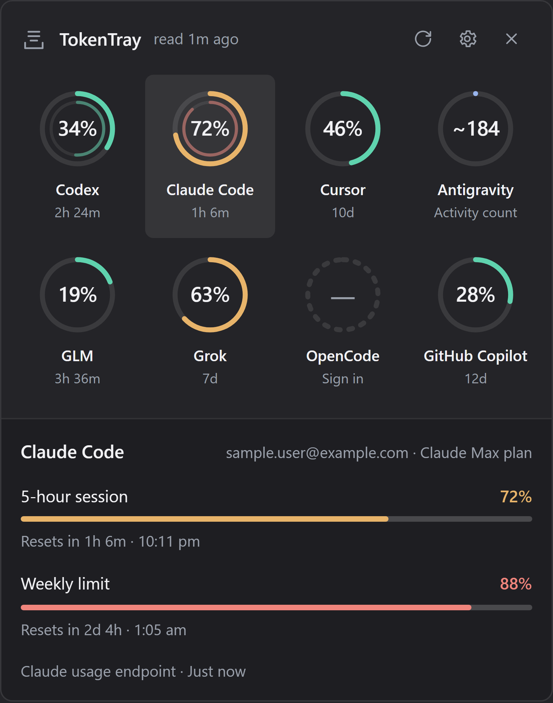
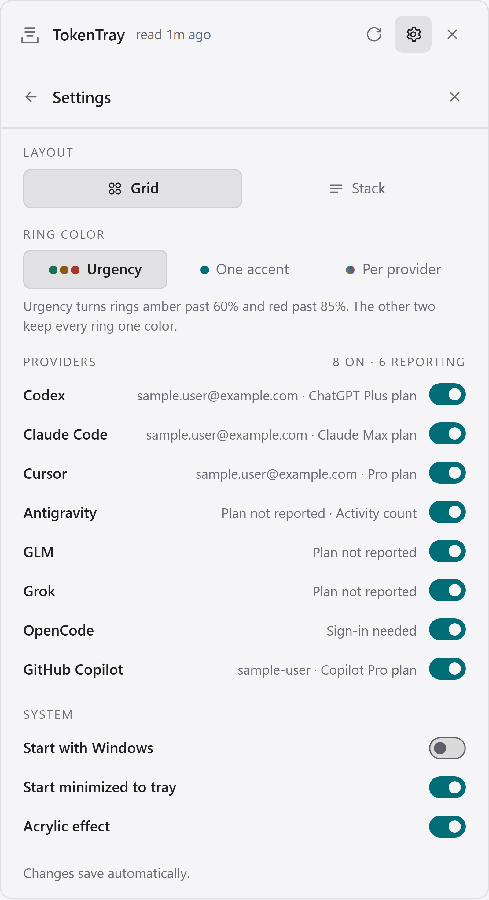
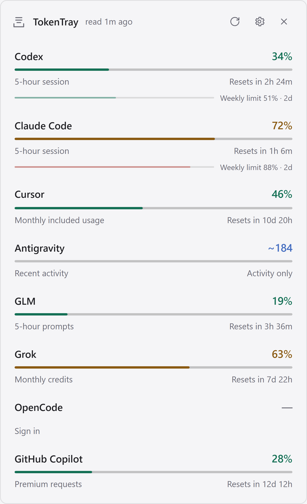

# TokenTray

**See how much of every AI coding assistant's usage allowance you have left, one click from your Windows tray.**

[](https://github.com/deeno13/tokentray/actions/workflows/windows.yml)
[](https://github.com/deeno13/tokentray/releases/latest)
[](LICENSE)


<p align="center">
  <picture>
    <source media="(prefers-color-scheme: dark)" srcset="docs/media/overview-dark.png">
    
  </picture>
</p>

TokenTray is a single portable executable that sits in the Windows notification area. Click it and a compact flyout shows a progress ring per provider — how much of the current window you have burned and when it resets. It reads the sessions your AI tools already store on your machine, so there is no account to create, no service to run and nothing to configure.

> **Early development build.** Eight provider adapters are implemented, but availability depends on each installed tool, account and endpoint. These quota endpoints are not documented public APIs and vendors change them without notice. Missing data is always shown as *unavailable*, never as zero usage.

## Contents

- [Why](#why)
- [Install](#install)
- [Supported providers](#supported-providers)
- [Using TokenTray](#using-tokentray)
- [Privacy and security](#privacy-and-security)
- [Build from source](#build-from-source)
- [Troubleshooting](#troubleshooting)
- [Contributing](#contributing)
- [License and attribution](#license-and-attribution)

## Why

If you use more than one AI coding assistant, you usually discover a limit by hitting it: a request fails mid-task, and you go hunting through a web dashboard to find out which window you exhausted and when it comes back. Each vendor reports that differently, and some only report it in their own app.

TokenTray puts all of them in one place, on the screen you are already working on, and tells you the reset time before you need it.

## Install

### Requirements

- Windows 10 or 11, x64
- [Microsoft Edge WebView2 Runtime](https://developer.microsoft.com/microsoft-edge/webview2/) (preinstalled on current Windows 11 and most Windows 10 machines)
- At least one supported AI tool, installed and signed in

### Download

Grab `tokentray-<version>-windows-x64.exe` from the [latest release](https://github.com/deeno13/tokentray/releases/latest).

There is no installer and no administrator access is required. Put the executable somewhere permanent before you run it — if you later enable *Start with Windows*, that path is what Windows remembers.

### Verify the download

Every release ships a `SHA256SUMS.txt`. Builds are unsigned, so Windows SmartScreen warns the first time you run one; checking the hash is the way to confirm you have the file this repository built:

```powershell
Get-FileHash .\tokentray-v0.1.0-windows-x64.exe -Algorithm SHA256
```

### First run

Double-click the executable. It adds an icon to the notification area and opens a short setup screen where you choose which providers to monitor; press **Start monitoring** and the overview appears.

If Windows hides the icon in the overflow area (the `^` chevron), drag it down into the visible notification area.

## Supported providers

TokenTray never asks you to sign in. For each provider it reuses the credential that the vendor's own tool already wrote to your machine.

| Provider | Where the number comes from | What you need |
|---|---|---|
| **Codex** | Documented `codex app-server` / `account/rateLimits/read` | Native Codex CLI signed in with ChatGPT. API-key-only quotas are billing, not a subscription allowance |
| **Claude Code** | Claude usage endpoint | An existing `.claude/.credentials.json`; honors `CLAUDE_CONFIG_DIR` |
| **Cursor** | Usage summary endpoint | Signed-in editor; `state.vscdb` is read, never written |
| **Antigravity** | Local language-server bridge, then the Google quota API, then a derived activity count | Installed and signed-in Antigravity. A derived count is explicitly **not** a quota percentage and is labelled as such |
| **GLM** | Z.ai / BigModel Coding Plan monitor | An existing Z.ai key in Claude Code, ZCode or OpenCode. Encrypted ZCode keys are skipped |
| **Grok** | Grok Build billing endpoint | An xAI-issued Grok CLI session in `.grok/auth.json` |
| **OpenCode** | OpenCode **Go plan** usage | An `opencode-go` credential. Unrelated vendor API keys are not counted as Go usage |
| **GitHub Copilot** | GitHub Copilot quota endpoint | GitHub CLI signed in to a Copilot account, or an inherited `GH_TOKEN` / `GITHUB_TOKEN` |

A provider you are not signed in to reports *signed out* rather than disappearing, so you can tell "no allowance used" apart from "no reading available".

## Using TokenTray

### The tray icon

- **Click** to open the flyout; **click again** to close it.
- **Right-click** for *Refresh usage*, *Open TokenTray*, *Start with Windows*, *Settings* and *Quit*.

The flyout opens at the bottom-right of whichever monitor holds the tray, with a 12-pixel gap from the taskbar and screen edges that scales with that monitor's DPI. It closes when you click elsewhere.

### The overview

Each provider gets a ring showing its current usage and the time until its next reset. Providers that expose both a short and a long window — a 5-hour session and a weekly cap, say — draw them as an inner and an outer ring on the same tile. The header reports the age of the *oldest* reading, so a single stale provider cannot make everything look fresher than it is.

Click a provider to see its individual limit windows. **Escape** goes back, then closes the popup.

<p align="center">
  
</p>

### Settings

| Setting | What it does |
|---|---|
| **Providers** | Enable or disable each one. Disabled providers are skipped by future checks |
| **Layout** | A four-column ring grid (default) or a full-width stack (below) |
| **Ring color** | *Urgency* (default: amber past 60%, red past 85%), *One accent* (one of six hues for every ring), or *Per provider* (each brand's own color) |
| **Acrylic** | Turn the native Windows Acrylic material off for an opaque surface |
| **Start with Windows** | Off by default. Registers this executable for your Windows sign-in, per-user, no administrator access |
| **Start minimized to tray** | On by default. Turn it off to have the popup open on every launch |

Settings also shows, per provider, the email or username it found, the plan the provider reports, and the connection state. A credential that carries no address — OpenCode's Go key, for instance — shows its plan instead.

Choices survive restarts. The tray menu's startup switch stays in sync with the one in Settings.

<p align="center">
  
  
</p>

<p align="center"><em>Settings, and the stack layout. All screenshots use sample data.</em></p>

### Command line

| Flag | Effect |
|---|---|
| `--show` | Open the flyout at launch, whatever the minimized preference says |
| `--startup` | Marks a Windows sign-in launch; leaves an already-running instance undisturbed |
| `--inspect` | Developer only. Shows the flyout as an ordinary taskbar window that stays open on blur, so Windows UI automation can see it |

Launching the executable while it is already running shows the existing popup instead of starting a second copy.

## Privacy and security

TokenTray adds **no login UI, no backend service, no telemetry and no key upload**. The native adapters read existing local sessions and talk to the corresponding provider directly.

**Credentials never leave Rust.** They are not logged, not written to TokenTray's own files, and never handed to the WebView frontend. Codex owns its own authentication when its app-server is invoked; TokenTray does not manage or refresh anyone's credentials.

**Monitoring is read-only.** It starts no agent turns, redeems no reset credits, and edits no provider configuration.

Two things are written to disk, both under `%APPDATA%\TokenTray`:

- `config.json` — your provider, appearance and startup preferences
- cached quota snapshots, so the popup has something to show before the first refresh completes

Neither contains credentials, prompts or answers. Account metadata shown in Settings is held in memory only. Stale readings keep their original timestamp rather than being presented as current.

Manual refresh honors each provider's cooldown; if a provider asks for backoff, TokenTray waits rather than retrying into a rate limit.

Found a hole in any of this? See [SECURITY.md](SECURITY.md) — report it privately, not as an issue.

## Build from source

You need Windows 10/11 x64 with Rust stable on the MSVC toolchain, the Visual Studio C++ Build Tools, the Windows SDK, WebView2, and Node.js 22+ for the frontend tests.

```powershell
cargo test --release --locked
node --test tests/*.test.mjs
cargo build --release --locked
.\target\release\tokentray.exe --show
```

The first build takes a few extra minutes because `rusqlite` compiles the bundled SQLite C sources.

The stack is Rust with [Tauri 2](https://tauri.app/) and a plain HTML/CSS/JavaScript frontend — no framework, no bundler, no `node_modules`. Provider parsing lives in small functions covered by synthetic-fixture tests, so you can work on an adapter without a live account.

For design work, serve `ui/` with any static server; browser preview labels its synthetic sample data, and native execution uses only real provider readings. With an existing Playwright install and Microsoft Edge, `node tests/browser-smoke.mjs` runs layout and click checks and writes screenshots to `ui-test-results/`.

The README images are generated, not hand-captured. `node tools/capture-screenshots.mjs` serves `ui/` against a mocked bridge carrying sample readings and drives an installed Chromium-based browser over the DevTools protocol, writing `docs/media/`. Re-run it after a visual change so the images cannot drift from the app, and never replace them with a capture of your own accounts.

Windows CI runs the parser tests, frontend model tests and a locked release build on every push, and uploads the executable as a build artifact. The committed `Cargo.lock` records the versions the Windows runner resolved; CI enforces it with `--locked`. A separate Release workflow runs on a `vX.Y.Z` tag: it checks the tag against `Cargo.toml` and `tauri.conf.json`, runs the same gate, and publishes the executable with its checksum.

See [stack research](docs/research.md) for how the stack was chosen and [DESIGN.md](DESIGN.md) for the visual system.

## Troubleshooting

**SmartScreen blocks the executable.** The build is unsigned. Verify the SHA-256 against the release's `SHA256SUMS.txt`, then choose *More info → Run anyway*. Code signing is future work.

**The tray icon is missing.** Windows likely put it in the overflow. Click the `^` chevron and drag TokenTray into the visible notification area.

**A provider says it is unavailable.** Confirm the vendor's own tool is installed and signed in on Windows — TokenTray reads native Windows credentials, so a WSL-only sign-in is not visible to it. Multiple accounts for one provider are not supported yet. Failing that, the provider may have moved its endpoint; please open an issue.

**Antigravity shows a count rather than a percentage.** Its quota API was unreachable, so TokenTray derived an activity count from local logs. It is deliberately labelled differently because it is not a quota.

**Start with Windows stopped working.** You probably moved the executable. Switch the setting off and back on to record the new path.

**The popup looks opaque.** Acrylic may be off in Settings, or Windows is honoring a high-contrast or reduced-transparency preference. Native material rendering also varies with Windows version and compositor settings.

## Contributing

Issues and pull requests are welcome. Read [CONTRIBUTING.md](CONTRIBUTING.md) first — it covers the dev setup and the handful of hard rules (credentials stay in Rust, provider access is read-only, missing quota is never zero).

Release history is in [CHANGELOG.md](CHANGELOG.md).

## License and attribution

MIT — see [LICENSE](LICENSE).

TokenTray reuses and modifies MIT code and assets from [CodeNotch](https://github.com/vinzdg/codenotch), specifically the Windows implementation from [Im-Midi/codenotch-windows](https://github.com/Im-Midi/codenotch-windows). Details are in [THIRD_PARTY_NOTICES.md](THIRD_PARTY_NOTICES.md).

TokenTray is not affiliated with those authors or with any provider vendor. Provider names and marks belong to their respective owners.
